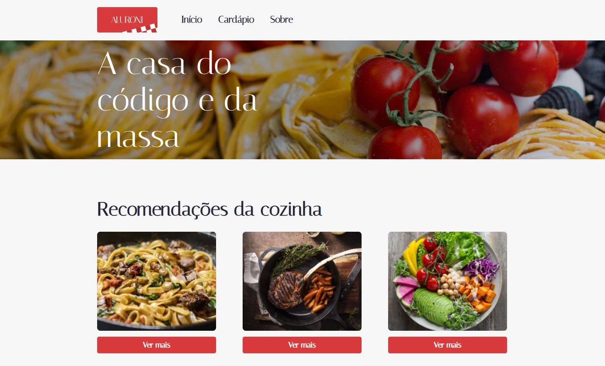
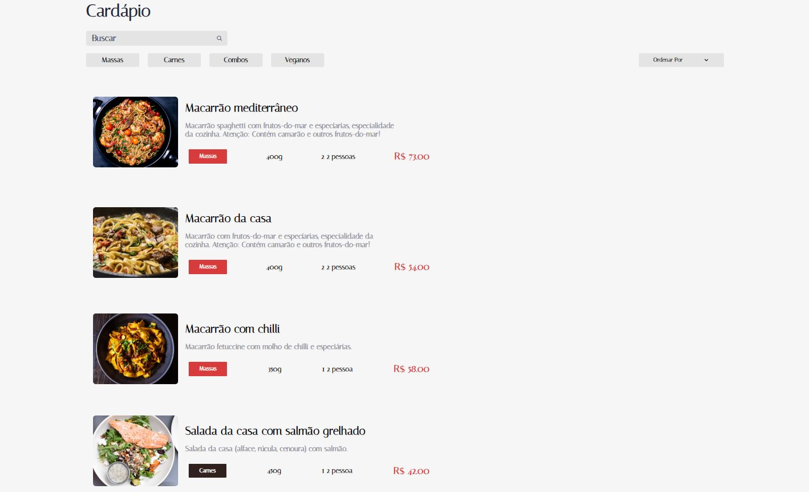

# Italian Restaurant

This is a web project developed in React with TypeScript for an Italian food restaurant, specialized in pasta, meat, combos and vegan options. The project has the following pages and is quiet:

* Home page

On the homepage, visitors are welcomed with dynamic recommendations from the kitchen, showing some types of dishes offered by the house. These recommendations are updated with each visit, providing users with variety. In addition, the homepage displays an interior photo of the establishment and provides address information.

* Menu page

The menu page lists all dishes offered by the restaurant. Users have the option of performing filters and dynamic searches to find specific dishes. Dishes are categorized into Pasta, Meat, Combos and Vegans, making navigation easier. It is also possible to order the options according to portion, number of people served and price. When clicking on a dish, users are redirected to a separate page with an enlarged photo of the selected dish.

* About page

The About page provides additional information about the property. Users can view a photo of the restaurant from the outside, as well as demonstrative images of the kitchen and the products offered. In addition, there is a description of the establishment, highlighting its history and proposal.

* Demonstrative images:

# Technologies Used

* TypeScript: The TypeScript language was used for the development of the project, providing an additional layer of security and static typing.

* React.Js: The system was built using the React framework, allowing the creation of interactive and reactive user interfaces.

* CSS Modules with SASS: To style the components, the CSS Modules approach was adopted with the SASS preprocessor, offering modularity and ease of styling.

* React Icon Pack: The project makes use of the React icon pack, which provides a vast library of icons for use in the user interface.

* Classnames Pack: The Classnames package was used to manipulate conditional classes in components, providing a more flexible and dynamic experience.

* React Router Dom: In this project, React Router Dom was used to create the different pages of the Italian restaurant website. Each page was represented by a separate component and mapped to a specific route. This allows users to access different sections of the site through different URLs, making navigation more intuitive and user-friendly.

* ESLint: ESLint was adopted as a development practice to ensure code quality and consistency. The linting rules can be customized according to the development team's preferences or following standards established by the community. ESLint can help identify syntax errors, style issues, unused variables, and other common issues.

# How to Use

* 1º Option: Access the website below: http://...

* 2º Option: Download the code and run it in your favorite code editor by following the steps below:

    1 - Install Node.Js 18 (or higher) from the official website https://nodejs.org/, if not installed.

    2 - Use the command "npm i" in the terminal to install all necessary dependencies.
    
    3 - Use the command "npm start" in the terminal to open the web system in your browser in http://localhost:3000

# Expansion

With this code base, you will be able to further expand the functionalities of this web system, as you will always have functionalities to add and refine errors, test, creating your own functionalities according to your needs.